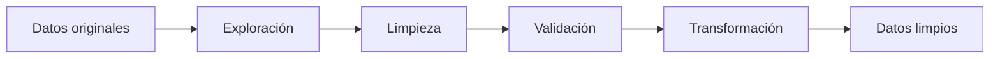

# Data Engineering Process

Proceso completo de **ingeniería y limpieza de datos** aplicado a una base de desempeño de trabajadores. El proyecto identifica valores faltantes, corrige tipos de datos, estandariza texto, analiza y elimina duplicados, crea nuevas variables y exporta una base limpia lista para análisis posteriores.

> **Objetivo:** transformar datos sin procesar en un conjunto consistente, completo y reutilizable mediante un flujo documentado y reproducible en Python.

---

## Flujo del proyecto



El proceso sigue estas etapas:

1. Carga e inspección inicial de los datos.
2. Identificación de valores faltantes.
3. Eliminación de columnas irrelevantes.
4. Tratamiento de datos faltantes según el tipo de variable.
5. Exploración de valores atípicos.
6. Corrección de tipos de datos y espacios en blanco.
7. Identificación y eliminación de duplicados.
8. Creación de nuevas variables.
9. Exportación de la base limpia a CSV y Excel.

---

## Tecnologías utilizadas


- **Python:** lenguaje principal.
- **pandas:** manipulación, limpieza y exportación de datos.
- **NumPy:** operaciones numéricas.
- **missingno:** visualización de valores faltantes.
- **Matplotlib y seaborn:** exploración gráfica.
- **Jupyter Notebook:** documentación y ejecución paso a paso.

---

## Estructura del repositorio

```text
data-engineering-process/
├── README.md
├── requirements.txt
├── .gitignore
├── notebooks/
│   └── S1_Data_engineering_process.ipynb
├── data/
│   └── Performance_workers.csv
└── outputs/
    ├── Clean_data_PerformanceWorkers.csv
    └── Clean_data_PerformanceWorkers.xlsx
```

Los archivos de `outputs/` se generan al ejecutar el notebook. La base incluida en `data/` fue anonimizada para conservar la lógica del ejercicio sin publicar nombres personales.

---

## Proceso paso a paso

### 1. Importación de librerías

Se importan las herramientas necesarias para manipular los datos, hacer cálculos y visualizar valores faltantes.

```python
import pandas as pd
import numpy as np
import seaborn as sns
import matplotlib.pyplot as plt
import missingno as msno
```

### 2. Carga e inspección inicial

La base se carga con `pandas`. Después se revisan sus dimensiones y algunos registros aleatorios.

```python
df = pd.read_csv("data/Performance_workers.csv")
print(df.shape)
df.sample(5)
```

`df.shape` devuelve una tupla con el número de filas y columnas. `df.sample(5)` permite observar cinco registros aleatorios sin asumir que las primeras filas representan toda la base.

### 3. Detección de valores faltantes

Se utilizan visualizaciones y un conteo exacto por columna.

```python
msno.matrix(df)
msno.bar(df)
df.isna().sum()
```

- `matrix()` muestra en qué posiciones faltan datos.
- `bar()` compara el nivel de completitud entre columnas.
- `isna().sum()` indica la cantidad exacta de valores vacíos.

### 4. Eliminación de columnas irrelevantes

La columna `Unnamed: 0` normalmente es un índice guardado por error y no aporta información analítica.

```python
df.drop(columns=["Unnamed: 0"], inplace=True)
```

### 5. Tratamiento de datos faltantes

No todos los vacíos deben tratarse de la misma forma:

```python
df.dropna(subset=["Nombre"], inplace=True)
df["Ciudad"] = df["Ciudad"].fillna("Desconocido")
df["Comentarios"] = df["Comentarios"].fillna("No especificado")
df["Edad"] = df["Edad"].fillna(df["Edad"].mean())
df["Puntuacion"] = df["Puntuacion"].fillna(df["Puntuacion"].mean())
```

La decisión depende del significado de cada variable:

- Se eliminan filas sin `Nombre` porque falta su identificador principal.
- Las categorías faltantes se reemplazan con etiquetas explícitas.
- Las variables numéricas se imputan con la media después de revisar los valores atípicos.

> Si una variable numérica presenta outliers fuertes, generalmente la **mediana** es más resistente que la media.

### 6. Exploración de valores atípicos

Los diagramas de caja ayudan a detectar observaciones alejadas del resto.

```python
df["Edad"].plot(kind="box")
df["Puntuacion"].plot(kind="box")
```

Un valor extremo no debe eliminarse automáticamente. Primero se comprueba si es un error, un caso real o una observación que requiere tratamiento especial.

### 7. Validación y corrección de tipos

```python
df.dtypes
df["Edad"] = df["Edad"].astype(int)
df[["Nombre", "Ciudad", "Comentarios"]] = (
    df[["Nombre", "Ciudad", "Comentarios"]].astype("category")
)
```

Corregir los tipos reduce errores y permite utilizar funciones apropiadas para cada variable.

### 8. Estandarización de texto

Se eliminan espacios al inicio y al final de los nombres para evitar categorías duplicadas artificialmente.

```python
df["Nombre"] = df["Nombre"].str.strip()
```

Por ejemplo, `"Ana"` y `" Ana "` deben considerarse el mismo valor.

### 9. Identificación de duplicados

Se analizan dos niveles:

```python
# Duplicados exactos: coinciden en todas las columnas
df.duplicated().sum()

# Posibles duplicados: coinciden en nombre y edad
df.duplicated(subset=["Nombre", "Edad"]).sum()
```

Los duplicados exactos pueden eliminarse directamente. Los duplicados parciales requieren revisión porque dos personas distintas podrían compartir nombre y edad.

```python
tam_inicial = df.shape[0]
df = df.drop_duplicates()
print(f"Se eliminaron {tam_inicial - df.shape[0]} registros")
```

### 10. Creación de nuevas variables

La puntuación se expresa como porcentaje respecto de la puntuación máxima observada.

```python
df["Rendimiento"] = (
    df["Puntuacion"] / df["Puntuacion"].max()
) * 100
```

El notebook también genera una variable llamada `Juventud`. Antes de utilizarla en decisiones, debe justificarse su fórmula y comprobarse que represente realmente el concepto deseado.

### 11. Validación final

Antes de exportar, se comprueba que no existan valores faltantes y que los tipos sean correctos.

```python
df.isna().sum()
df.dtypes
df.shape
```

### 12. Exportación

```python
df.to_csv("outputs/Clean_data_PerformanceWorkers.csv", index=False)
df.to_excel("outputs/Clean_data_PerformanceWorkers.xlsx", index=False)
```

El resultado es una base limpia disponible en dos formatos.

---

## Cómo ejecutar el proyecto

### Opción 1: Jupyter Notebook

```bash
git clone https://github.com/fernandatrevi/data-engineering-process.git
cd data-engineering-process
python -m venv .venv
source .venv/bin/activate
pip install -r requirements.txt
jupyter notebook
```

En Windows, activa el entorno con:

```powershell
.venv\Scripts\activate
```

Después abre `notebooks/S1_Data_engineering_process.ipynb` y ejecuta las celdas en orden.

### Opción 2: Google Colab

1. Abre el notebook desde GitHub.
2. Selecciona **Open in Colab**.
3. Carga `Performance_workers.csv` cuando sea necesario.
4. Ejecuta las celdas desde el inicio.

---

## Resultados esperados

Al finalizar el proceso se obtiene:

- Una base sin duplicados exactos.
- Tratamiento documentado de valores faltantes.
- Tipos de datos corregidos.
- Texto estandarizado.
- Una variable porcentual de rendimiento.
- Archivos limpios en formatos CSV y Excel.

---

## Decisiones que requieren atención

- Confirmar que `Unnamed: 0` no contenga información útil antes de eliminarla.
- Evitar convertir `Edad` a entero sin revisar cómo debe redondearse la media imputada.
- No eliminar duplicados parciales únicamente por compartir nombre y edad.
- Justificar la fórmula de `Juventud`; actualmente necesita una definición conceptual más clara.
- Anonimizar nombres u otros datos personales antes de publicar la base.

---

## Autora

Proyecto académico de Analítica Avanzada.
